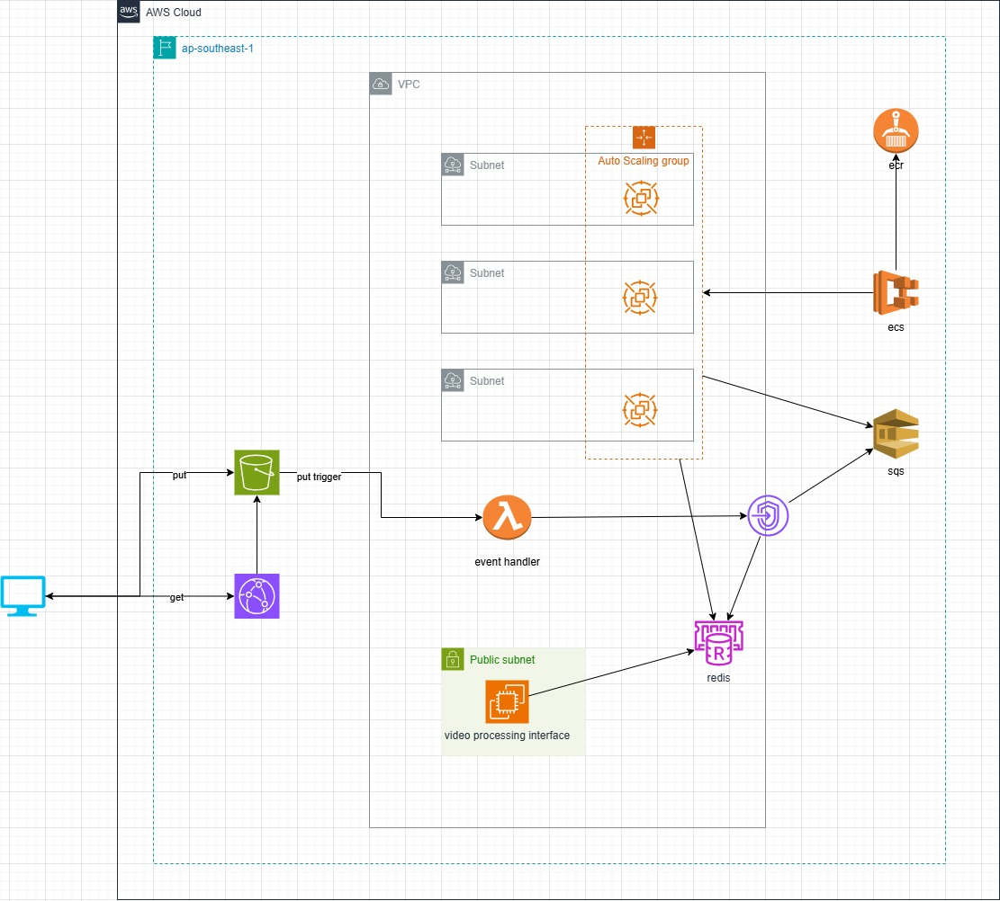

# Nghịch AWS

## Processing video from normal format into HLS using aws.

-   infra: cloudfront template
-   video_processing_interface: quarkus java application for create s3 post policy and observing the processing progress
-   video_processing_task: celery task for ffmpeg processing and lambda handler for s3 put object event
     

